# carm_grasp

基于 CARM 机械臂、ROS2 和 RGB-D 相机的抓取示例工程，覆盖机械臂控制、相机与手眼标定、夹爪标定、动作模板录制回放，以及基于 AprilTag 的 2D / 3D 抓取示例。

<div align="center">
  <table>
    <tr>
      <td align="center"></td>
      <td width="40"></td>
      <td align="center"></td>
    </tr>
    <tr>
      <td align="center"><sub>2D抓取</sub></td>
      <td></td>
      <td align="center"><sub>3D抓取</sub></td>
    </tr>
  </table>
</div>

> **注意：**
> - 当前 2D / 3D 抓取示例都假设目标表面可稳定检测到 AprilTag。
> - 3D 抓取不仅依赖 RGB-D 图像，还依赖手眼标定和夹爪几何模型（用于简易的碰撞检测）。
---

## 硬件支持

| 硬件 | 说明 |
|------|------|
| **CARM 机械臂** | 自研六轴机械臂，支持 Position / MIT / TEACH / PF 控制模式 |
| **Intel RealSense D405** | RGB-D 相机（眼在手），彩色 + 深度对齐 |
| **Orbbec Gemini 305** | RGB-D 相机（眼在手），彩色 + 深度对齐 |

---

## 所需物料

| 物料 | 说明 | 图例 |
|------|------|------|
| **标定板** | AprilTag 标定板（≥4 个 tag，推荐 6×6），用于相机内参标定和手眼标定 | 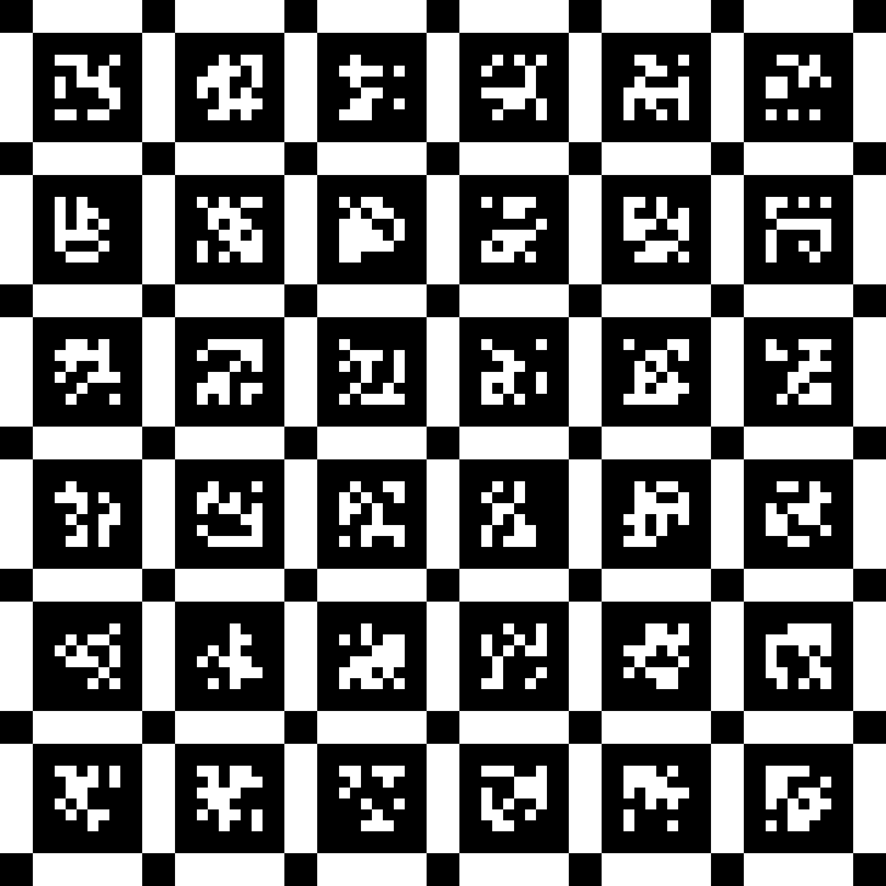<br/>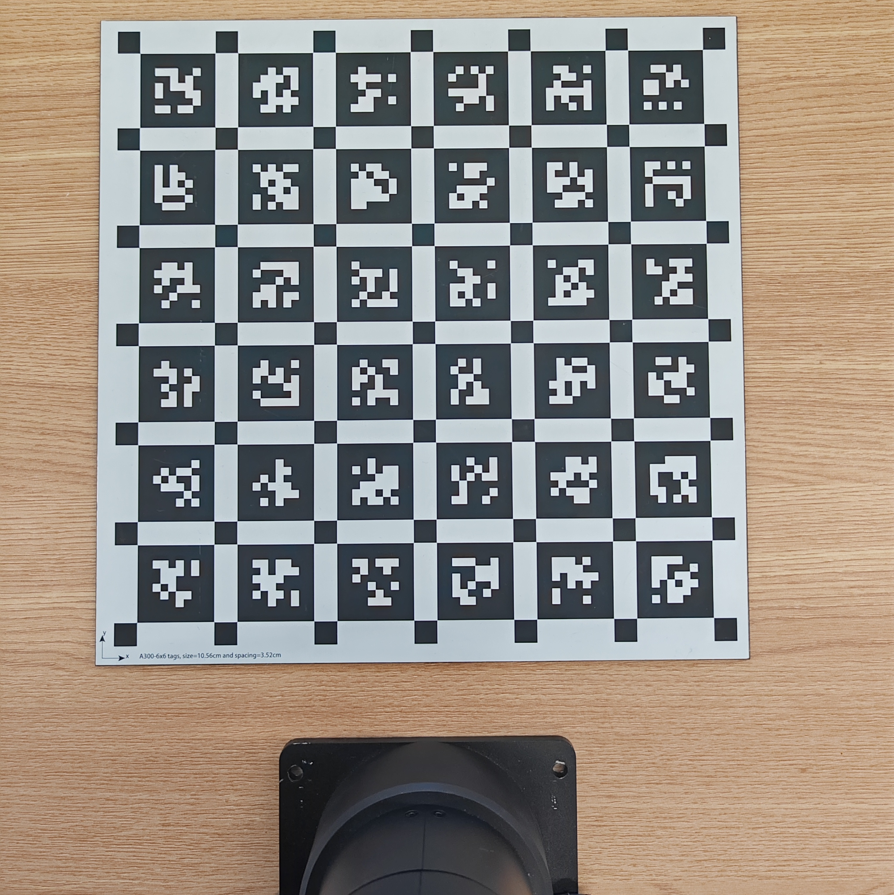<br/>上：原图（开发者可以直接用于打印） ｜ 右：实拍 |
| **夹爪标定工具** | 中心贴有 AprilTag（ID=0）的平板，用于标定夹爪→相机位姿 | 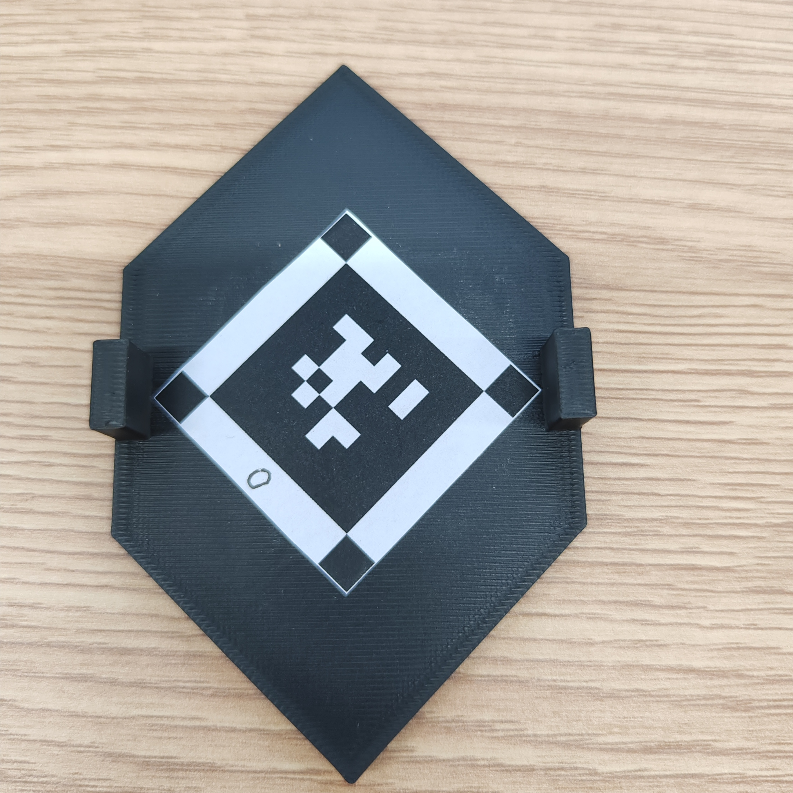 |
| **抓取物体** | 贴有 AprilTag（ID=0）的方块（4×4 cm），用于抓取演示 | 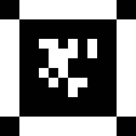<br/>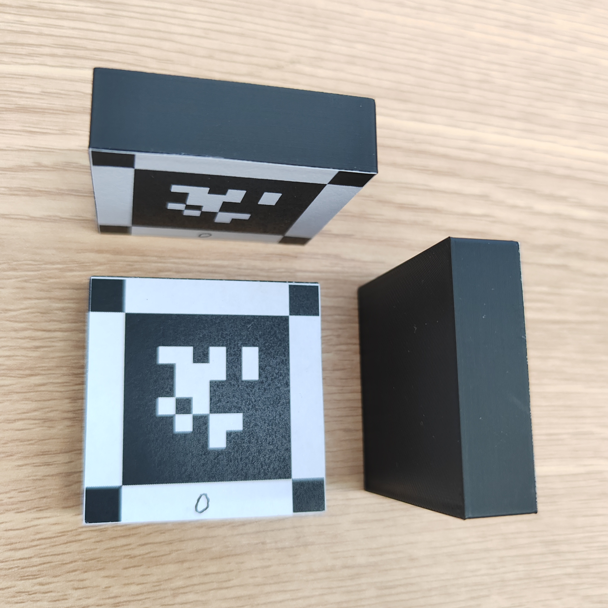<br/>上：原图（开发者可以直接用于打印） ｜ 下：实拍 |
| **相机支架** | 将相机固定在机械臂末端，确保相机 Z 轴与末端 Z 轴夹角 < 45° | 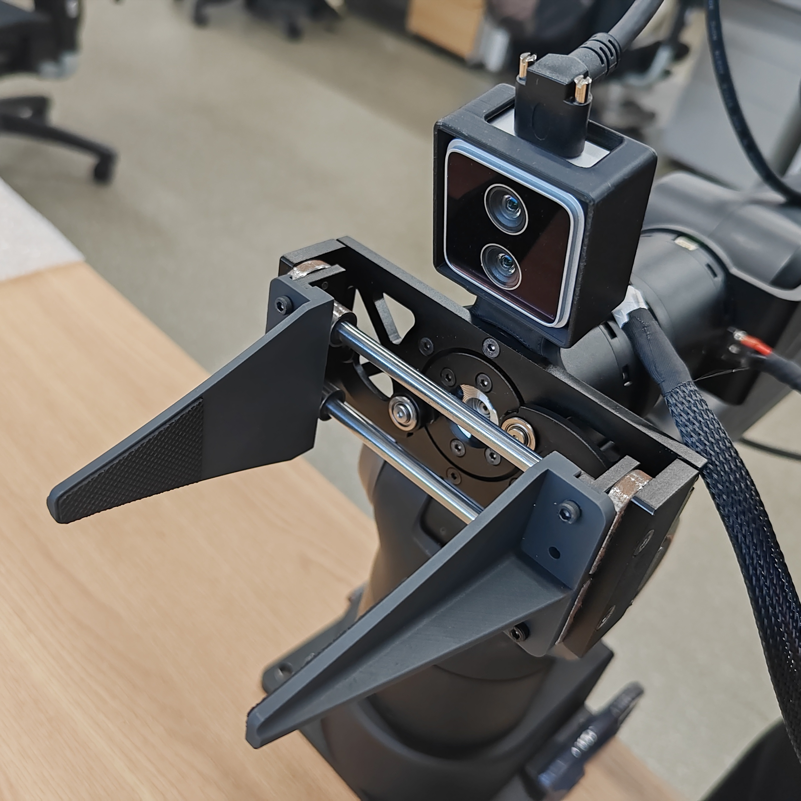 |

---
## 环境准备

在运行任何脚本之前，请确保以下硬件和软件环境已就绪。

### 1. 机械臂连接

- 给 CARM 机械臂上电，确认机械臂与控制 PC 在同一局域网。
- 默认 IP 地址为 `10.42.0.101`，可通过 `ping 10.42.0.101` 验证连通性。
- 若 IP 不同，所有 Python 脚本中 `ArmWrapper` 的 `ip` 参数需对应修改。

### 2. 相机驱动与话题验证

根据你的相机型号启动对应驱动，确保 ROS2 话题正常发布：

| 相机 | 彩色话题（参考） | 深度话题（参考） |
|------|-----------------|-----------------|
| Intel RealSense D405 | `/realsense/d405/color/image_rect_raw` | `/realsense/d405/aligned_depth_to_color/image_raw` |
| Orbbec Gemini 305 | `/gemini305/color/image_raw` | `/gemini305/depth/image_raw` |

> 实际话题名取决于你的驱动配置，请用 `ros2 topic list` 确认。

验证步骤：
```bash
# 1. 确认 ROS2 环境已 source（Foxy 或 Humble 二选一）
source /opt/ros/humble/setup.bash

# 2. 查看话题列表，确认彩色/深度/CameraInfo( 可选 ) 话题存在
ros2 topic list | grep -E "color|depth|camera_info"

# 3. 用 rqt_image_view 预览图像，确认画面正常
ros2 run rqt_image_view rqt_image_view
```

### 3. ROS_DOMAIN_ID 设置

如果同一网络中有多台 ROS2 设备，需设置 `ROS_DOMAIN_ID` 隔离通信。所有 shell 脚本默认设为 `1`，请根据实际网络环境修改：

```bash
export ROS_DOMAIN_ID=1   # 0-101，确保所有设备一致
```

### 4. 相机安装要求

- 相机通过支架固定于机械臂末端（eye-in-hand 配置）。
- 确保相机 Z 轴与末端 Z 轴夹角 < 45°，以获得良好的深度观测角度。
- 安装完毕后，相机相对于末端的位置不应再发生变化（否则需重新手眼标定）。

### 5. 工作区布局建议

```
        ┌──────────────┐      ┌─────────────┐
        │   机械臂基座   │-----│  [放置区]     │
        └──────┬───────┘      └─────────────┘
               │
        ┌──────┴───────┐
        │   操作区域    │
        │              │
        │  [抓取物体]   │
        └──────────────┘
```

- 抓取物体和放置区域应在机械臂的工作空间内。
- 标定时将标定板平放于操作区域，确保机械臂能到达标定板的多个视角。

---
## 依赖

| 组件 | 版本 | 用途 |
|------|------|------|
| [apriltag2](https://github.com/cvte-robotics/apriltag2) | — | AprilTag 检测与位姿估计 |
| [carm](https://pypi.org/project/carm/) | ≥ 0.1.20260706 | CARM 机械臂 Python SDK |
| ROS2 (Foxy / Humble) | — | `rclpy`、`cv_bridge`、`message_filters`、`tf2_ros` |
| numpy | 1.24.4 | 数值计算 |
| opencv-python | 4.7.0.72 | 图像处理、相机标定、手眼标定 |
| open3d | 0.19.0 | 点云处理与可视化 |
| mmengine | — | 配置文件读写 |
| transforms3d | — | 三维刚体变换（四元数/旋转矩阵/欧拉角互转） |

### 安装示例

```bash
# Python 依赖
pip install numpy==1.24.4 opencv-python==4.7.0.72 open3d==0.19.0 mmengine transforms3d

# CARM SDK
pip install carm==0.1.20260706
```

> `apriltag2` 的安装方式取决于你的环境，请按项目的README.md说明配置。

---

## 目录结构

```
carm_grasp/
├── core/                          # 核心库：机械臂封装、视觉匹配、ROS2 工具、几何变换
│   ├── arm_wrapper.py             #    CARM 机械臂 SDK 统一封装
│   ├── arm_utils.py               #    夹爪几何模型 (GripperBody) 与碰撞检测 (CollisionDetector)
│   ├── arm_ros_utils.py           #    机械臂 ROS2 工具：位姿发布、Marker 可视化、ArmNode
│   ├── cam_ros_utils.py           #    相机 ROS2 节点：多话题时间同步订阅 (CamNode)
│   ├── vision_utils.py            #    视觉工具：点云生成、2D/3D AprilTag 匹配器、投影变换
│   └── utils.py                   #    通用工具：彩色打印、键盘读取、标定文件读写、TF 工具
│
├── examples/
│   ├── common/
│   │   ├── src/                   # 基础能力示例
│   │   │   ├── action_record.py   #   动作模板录制
│   │   │   ├── action_play.py     #   动作模板回放
│   │   │   ├── auto_collect.py    #   自动采集（按模板依次执行并保存机械臂状态+图像）
│   │   │   ├── arm_node.py        #   机械臂 ROS2 状态发布节点
│   │   │   ├── calib_camera.py    #   相机内参标定（基于 AprilTag 标定板）
│   │   │   ├── calib_gripper.py   #   夹爪标定（夹爪→相机位姿）
│   │   │   ├── calib_handeye.py   #   手眼标定（AX=XB）
│   │   │   └── create_collect_actions.py  # 自动生成采集动作模板（半球面采样）
│   │   └── scripts/               # 对应 shell 启动脚本
│   │
│   └── benchmark/
│       ├── src/                   # 抓取基准示例
│       │   ├── create_tmpl_grasp_2d.py  # 创建 2D 抓取模板
│       │   ├── test_tmpl_grasp_2d.py    # 测试 2D 视觉伺服抓取
│       │   ├── create_tmpl_grasp_3d.py  # 创建 3D 抓取模板
│       │   └── test_tmpl_grasp_3d.py    # 测试 3D 视觉伺服抓取
│       └── scripts/               # 对应 shell 启动脚本
│
├── demo/                          # 开箱即用演示（预配置好的脚本 + 示例数据）
│   ├── data/
│   │   ├── action/                #   预录制动作模板（标定用 / 采集用）
│   │   ├── calib/                 #   标定结果（D405 / G305 相机参数、手眼矩阵、夹爪模型）
│   │   │                          #   ⚠ 仅供格式参考，实际使用需用自己的硬件重新标定
│   │   ├── collect/               #   采集数据样例
│   │   └── benchmark/             #   抓取模板样例（grasp_2d / grasp_3d）
│   └── scripts/                   #   可直接运行的启动脚本（action_record、auto_collect、标定、测试）
│
├── rviz/                          # RViz 配置文件
├── scripts/                       # 通用脚本（open_rviz.sh）
└── results/                       # 调试/运行结果输出
```

---

## 工作流程

> 每个标定任务的实际流程是：**录制轨迹 → 自动采集 → 执行标定**。相机标定和手眼标定需要分别录制不同的采集轨迹。

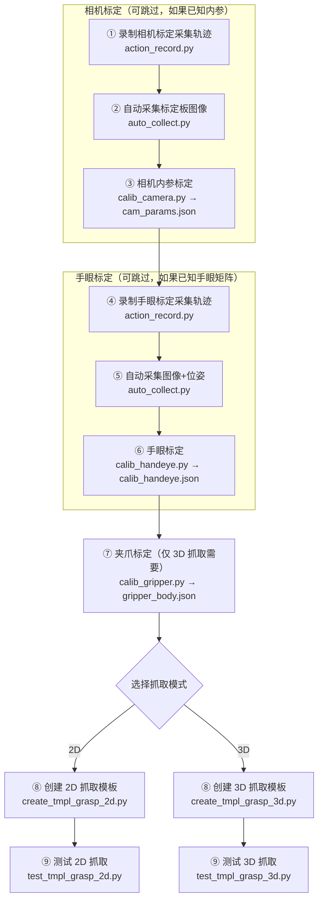
```mermaid
flowchart TD
    subgraph camera_calib ["相机标定（可跳过，如果已知内参）"]
        A1["① 录制相机标定采集轨迹<br/>action_record.py"] --> A2["② 自动采集标定板图像<br/>auto_collect.py"]
        A2 --> A3["③ 相机内参标定<br/>calib_camera.py → cam_params.json"]
    end
    subgraph handeye_calib ["手眼标定（可跳过，如果已知手眼矩阵）"]
        B1["④ 录制手眼标定采集轨迹<br/>action_record.py"] --> B2["⑤ 自动采集图像+位姿<br/>auto_collect.py"]
        B2 --> B3["⑥ 手眼标定<br/>calib_handeye.py → calib_handeye.json"]
    end
    A3 --> B1
    B3 --> C["⑦ 夹爪标定（仅 3D 抓取需要）<br/>calib_gripper.py → gripper_body.json"]
    C --> D{选择抓取模式}
    D -->|2D| E["⑧ 创建 2D 抓取模板<br/>create_tmpl_grasp_2d.py"]
    D -->|3D| F["⑧ 创建 3D 抓取模板<br/>create_tmpl_grasp_3d.py"]
    E --> G["⑨ 测试 2D 抓取<br/>test_tmpl_grasp_2d.py"]
    F --> H["⑨ 测试 3D 抓取<br/>test_tmpl_grasp_3d.py"]
```

### 前置步骤（标定）

#### 相机内参标定（步骤 ① → ② → ③）

1. **录制采集轨迹** — 运行 `action_record.py`，在拖动模式下将机械臂移动到标定板的不同视角，按 `s` 保存各姿态。需确保标定板在图像中占比适中、角度多样、覆盖视野的各个区域。保存的模板写入 `calib_camera` 目录。
2. **自动采集图像** — 运行 `auto_collect.py`（相机标定配置），机械臂自动依次执行上一步录制的模板，在每个位姿采集彩色图像。
3. **执行标定** — 运行 `calib_camera.py`，读取图像执行针孔模型标定，生成 `cam_params.json`。

<p align="center"></p>

> **标定板参数说明**：`calib_board_info` 格式为 `[tag_size, space_size, tag_rows, tag_cols]`，单位均为米。例如 `[0.0352, 0.01056, 6, 6]` 表示单个 tag 边长 35.2mm，tag 间距 10.56mm，共 6×6 个 tag。请根据你实际打印的标定板测量并替换。

#### 手眼标定（步骤 ④ → ⑤ → ⑥）

1. **录制采集轨迹** — 再次运行 `action_record.py`，录制一组新的轨迹模板。注意：手眼标定的轨迹需要让标定板始终在视野内，且末端姿态变化足够丰富（平移 + 旋转），保存到 `calib_handeye` 目录。
2. **自动采集** — 运行 `auto_collect.py`（手眼标定配置），同时采集彩色图、深度图和机械臂末端位姿。
3. **执行标定** — 运行 `calib_handeye.py`，求解 $AX = XB$ 得到末端到相机的变换矩阵 $T_{end}^{cam}$，生成 `calib_handeye.json`。

#### 夹爪标定（步骤 ⑦）

使末端朝下，张开夹爪并对准夹爪上的 AprilTag（ID=0）平面，用 `calib_gripper.py` 采集 RGB-D 图像估计夹爪位姿，生成 `gripper_body.json`。

<p align="center">
  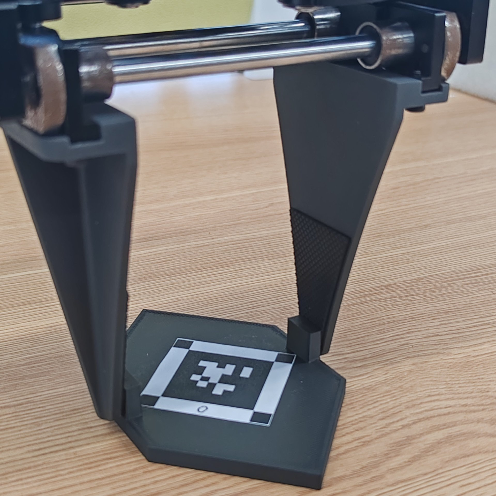
  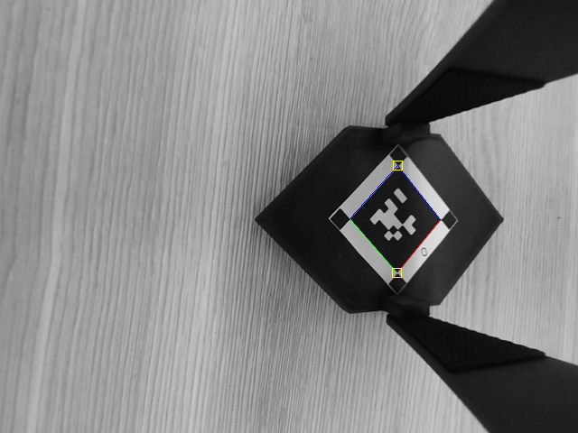
</p>

### 抓取模式

#### 2D 抓取（3 自由度：$x, y, \theta$）

适用于物体放置在水平面（与机械臂基座的XOY平面平行）上、仅需平面定位的场景（目前不允许视野里仅允许存在一个贴了 apriltag 的物体）。

<p align="center"></p>

**模板录制** (`create_tmpl_grasp_2d.py`) — 录制 5 个状态：抓取位姿、近距检测位姿（×2）、远距检测位姿（×2），保存物体在图像中的 2D 位姿和末端状态。

| 状态 | 说明 | 示意图 |
|------|------|--------|
| grasp | 抓取位姿：末端朝下，夹爪张开至刚好能抓取物体 | 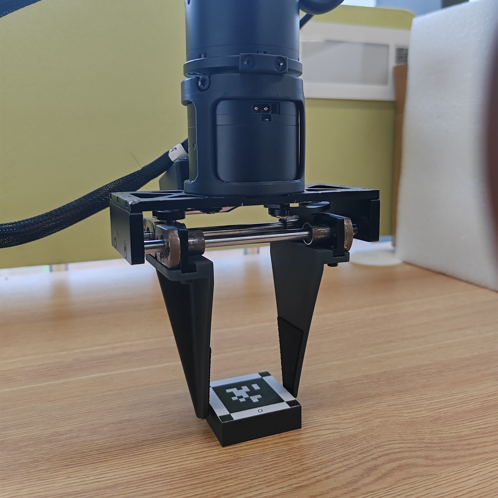 |
| near / next_near | 近距检测位姿：略高于抓取位姿，末端朝下，夹爪张开至最大 | 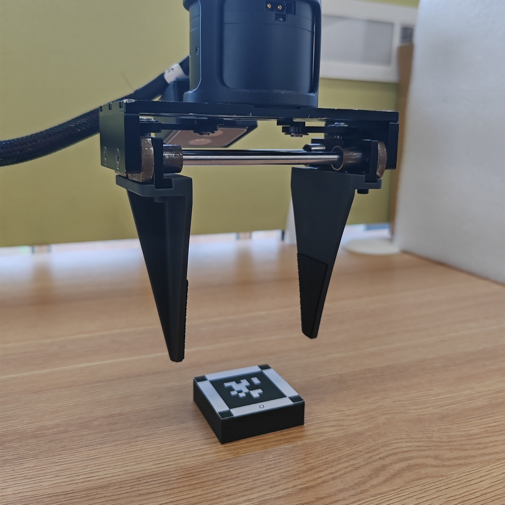 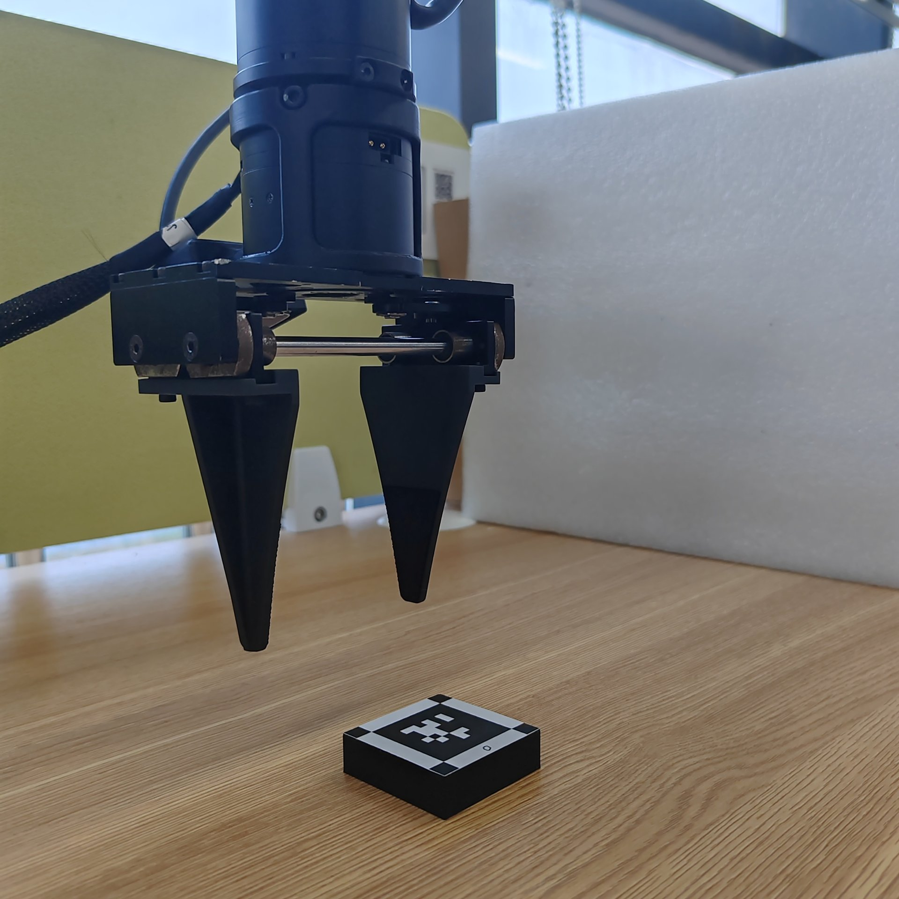 |
| far / next_far | 远距检测位姿：末端朝下，夹爪张开至最大 | 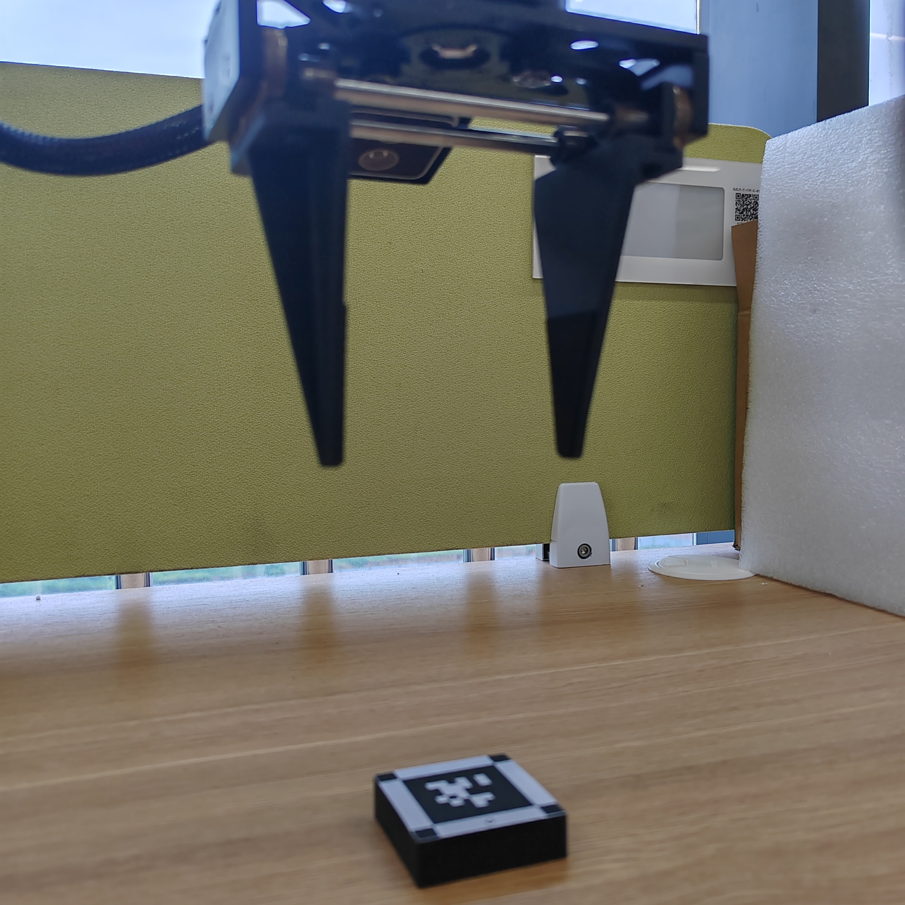 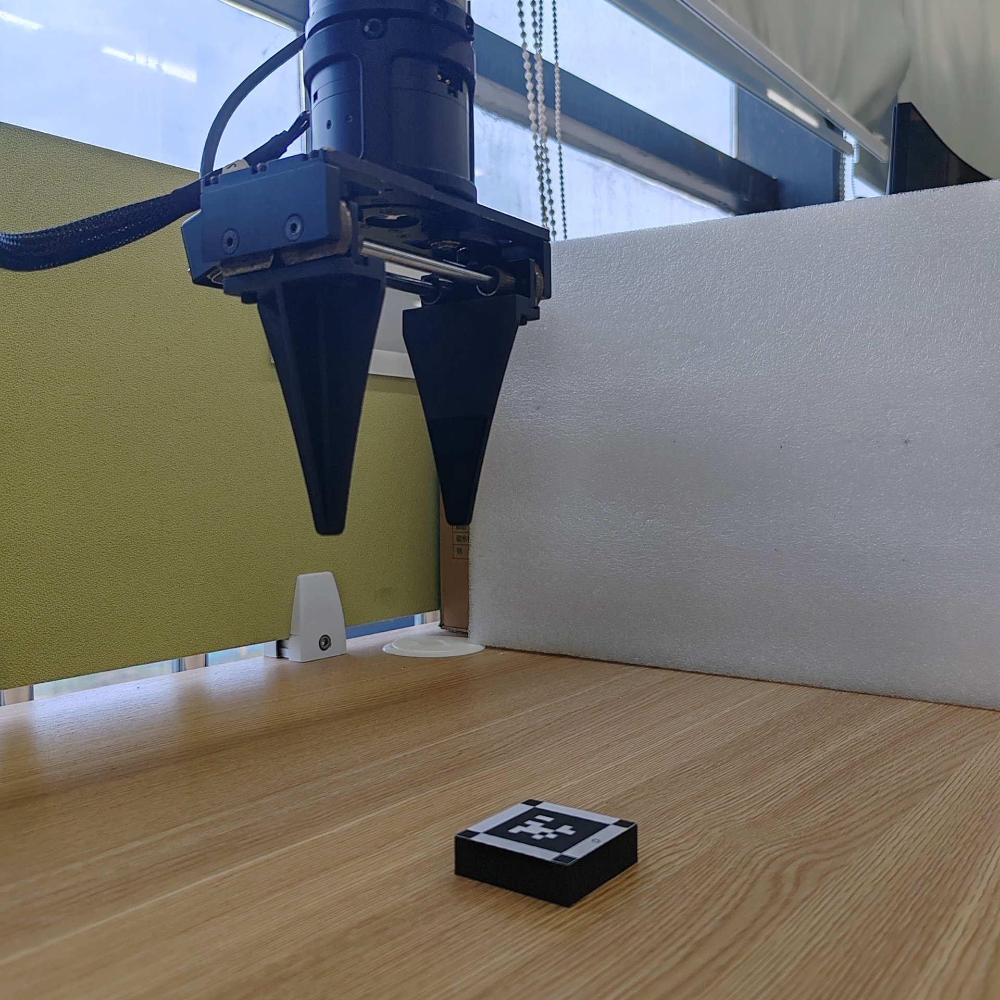 |

**视觉伺服抓取** (`test_tmpl_grasp_2d.py`)：
- 使用「虚拟相机」归一化坐标系，在 near/far 模板之间线性插值 Jacobian 比值
- 迭代调整末端位姿直到物体在图像中的观测与模板一致（平移 < 1mm，旋转 < 2°），再执行抓取

#### 3D 抓取（6 自由度）

适用于物体在空间中具有任意位姿的场景。

<p align="center"></p>

**模板录制** (`create_tmpl_grasp_3d.py`) — 录制 2 个状态：抓取位姿和预备位姿，保存物体在相机坐标系中的 3D 位姿 $T_{cam}^{model}$。

| 状态 | 说明 | 示意图 |
|------|------|--------|
| grasp | 抓取位姿：末端朝下，夹爪张开至刚好能抓取物体 |  |
| ready | 预备位姿：略高于抓取位姿，便于过渡到抓取位姿 |  |

**视觉伺服抓取** (`test_tmpl_grasp_3d.py`)：
1. **Match** — 匹配物体，获取初始 $T_{cam}^{model}$
2. **Compute & Move** — 计算预备位姿使物体在相机中的位姿与模板一致，移动机械臂
3. **Refine** — 迭代细化（track → 重算预备位姿 → 移动），最多 2 轮
4. **Grasp** — 执行最终抓取位姿 → 闭合夹爪 → 抬高
5. 包含基于夹爪几何模型的简易碰撞检测（夹爪投影到深度图判断干涉）

---

## core 模块 API 概览

### `arm_wrapper.py` — ArmWrapper

CARm 机械臂 SDK 的统一封装类。

```python
from core.arm_wrapper import ArmWrapper

arm = ArmWrapper(ip="10.42.0.101", control_mode=ArmWrapper.ControlMode.POSITION, speed_level=50)

# 控制模式
arm.set_control_mode(ArmWrapper.ControlMode.PF)   # POSITION / MIT / TEACH / PF

# 运动控制
arm.set_joints([0, 0, 0, 0, 0, 0])                 # 关节角控制
arm.set_pose(T_base_end)                           # 末端位姿控制 (4×4)
arm.set_gripper_dist(0.05)                         # 夹爪开度 (m)

# 状态查询
T = arm.get_pose()                                 # 末端位姿
joints = arm.get_joints()                          # 关节角
dist = arm.get_gripper_dist()                      # 夹爪距离
arm.set_speed_level(80)                            # 速度 1-100
```

### `arm_utils.py` — GripperBody / CollisionDetector

- **GripperBody**：用两个矩形面片建模夹爪几何体，支持从 AprilTag 角点初始化夹爪→相机位姿，以及计算任意目标坐标系下的夹爪 3D 顶点。
- **CollisionDetector**：将夹爪投影到参考深度图，通过比较投影深度与真实深度检测碰撞（仅适用于 eye-in-hand）。

### `cam_ros_utils.py` — CamNode

多话题时间同步的 ROS2 相机节点，基于 `message_filters.ApproximateTimeSynchronizer`。

```python
cam_node = CamNode(
    img_topic_list=["/color/image_raw", "/depth/image_raw"],
    cam_info_topic_list=["/color/camera_info"],
    reliability=1  # 0=SYSTEM_DEFAULT, 1=RELIABLE, 2=BEST_EFFORT
)
imgs = cam_node.get_frames()  # 获取一帧同步图像
```

### `vision_utils.py` — 视觉匹配与工具

| 类/函数 | 说明 |
|---------|------|
| `TagMatcher2D` | 2D AprilTag 匹配器，输出标签 ID、角点、归一化平面位姿 $(nx, ny, \theta)$ |
| `TagMatcher3D` | 3D AprilTag 匹配器，输出标签 ID、角点、$T_{cam}^{tag}$，支持 match/track 两种模式 |
| `rgbd_to_point_cloud()` | RGB-D → 彩色点云 (Open3D) |
| `depth_to_point_cloud()` | 深度图 → 点云 |
| `depth_mean_filter()` | 多帧深度图均值滤波（按观测次数加权） |
| `compute_locate_error()` | 计算定位误差（位置 mm + 角度 deg），支持对称物体 |
| `compute_projective_transformation()` | 计算虚拟相机投影变换矩阵 |
| `compute_tag_pose_2d()` | 从 AprilTag 2D 角点计算平面位姿 |
| `compute_tag_mask()` | 生成标签区域掩码 |

### `utils.py` — 通用工具

| 函数 | 说明 |
|------|------|
| `read_cam_params()` | 读取相机内参 JSON |
| `read_calib_handeye()` | 读取手眼标定结果 JSON |
| `read_rgbd_params()` | 读取 RGB-D 相机参数（内参 + 深度缩放） |
| `inv_tf()` | 求位姿矩阵的逆 |
| `wait_key()` | 等待按键（支持 debug 模式暂停） |
| `KeyboardReader` | 非阻塞键盘读取类 |
| `reset_empty_str()` | 空字符串转 None，路径规范化 |

---

## 快速开始

> **说明**：`demo/` 目录提供了预配置的 shell 脚本和示例数据，适合快速体验。`examples/` 目录是参考实现源码。首次使用时，建议先阅读 `demo/scripts/*.sh` 中的参数配置，根据实际硬件修改话题名、`ROS_DOMAIN_ID` 等参数。

### 前置要求

- 已完成 [环境准备](#环境准备) 中的所有步骤。
- 机械臂可通过 `carm` 正常连接（默认 IP：`10.42.0.101`）。
- 相机驱动已启动，ROS2 话题正常发布（用 `ros2 topic list` 验证）。
- 根据实际设备修改对应 `.sh` 中的话题名、`ROS_DOMAIN_ID`。
- shell 脚本同时写了 `source /opt/ros/foxy/setup.bash` 和 `source /opt/ros/humble/setup.bash`，请**注释掉不需要的那一行**。

---

### 完整操作步骤

> 如果你已有标定文件，可直接跳到第 8 步。也可直接使用 `demo/data/calib/` 下的预置标定结果快速体验。

#### 第一阶段：相机内参标定（步骤 ①–③）

```bash
cd demo/scripts

# ① 录制相机标定用的采集轨迹
#    修改 action_record.sh：将 tmpl_dir 指向 calib_camera 目录
#    （拖动机械臂到标定板的不同视角，按 s 保存）
./action_record.sh

# ② 自动采集标定板图像
#    修改 auto_collect.sh：
#      - 注释掉手眼标定的配置，启用相机标定的配置
#      - 确认 img_topic_list 仅包含彩色话题
#      - data_dir 指向 calib_camera 目录
./auto_collect.sh

# ③ 执行相机标定 → 生成 cam_params.json
#    修改 calib_camera.sh：确认 calib_board_info 的 tag 尺寸与实际一致
./calib_camera.sh
```

#### 第二阶段：手眼标定（步骤 ④–⑥）

```bash
cd demo/scripts

# ④ 录制手眼标定用的采集轨迹
#    修改 action_record.sh：将 tmpl_dir 指向 calib_handeye 目录
#    （轨迹需要让标定板始终在视野内，末端姿态变化足够丰富）
./action_record.sh

# ⑤ 自动采集图像 + 机械臂位姿
#    修改 auto_collect.sh：
#      - 启用手眼标定的配置（彩色 + 深度话题）
#      - data_dir 指向 calib_handeye 目录
./auto_collect.sh

# ⑥ 执行手眼标定 → 生成 calib_handeye.json
#    修改 calib_handeye.sh：确认 cam_param_path 指向上一步生成的 cam_params.json
./calib_handeye.sh
```

#### 第三阶段：夹爪标定（步骤 ⑦，仅 3D 抓取需要）

```bash
cd demo/scripts

# ⑦ 夹爪标定 → 生成 gripper_body.json
#    修改 calib_gripper.sh：确认话题名、cam_params_path、calib_handeye_path
./calib_gripper.sh
```

#### 验证标定结果

```bash
# 启动 RViz 检查 TF 树和点云对齐情况
../scripts/open_rviz.sh

# 另开终端，启动机械臂状态发布节点（观察 arm_end→camera 的 TF）
bash examples/common/scripts/arm_node.sh
```

> 在 RViz 中检查：
> - TF 树中 `base_link → arm_end → camera_link` 的变换是否合理（相机应位于末端附近）。
> - 点云与机械臂模型的相对位置是否一致。

#### 第四阶段：2D 抓取（步骤 ⑧–⑨）

```bash
cd demo/scripts

# ⑧ 创建 2D 抓取模板
#    修改 create_tmpl_grasp_2d.sh：确认话题名、cam_params_path、tmpl_dir
./create_tmpl_grasp_2d.sh
#    交互录制：g→抓取位姿, n→near, b→next_near, f→far, d→next_far

# ⑨ 测试 2D 抓取
#    修改 test_tmpl_grasp_2d.sh：
#      - 确认话题名、cam_params_path、calib_handeye_path、tmpl_dir
#      - 填入 detect_pose 和 place_pose（获取方法见下文）
./test_tmpl_grasp_2d.sh
```

#### 第四阶段：3D 抓取（步骤 ⑧–⑨）

```bash
cd demo/scripts

# ⑧ 创建 3D 抓取模板
#    修改 create_tmpl_grasp_3d.sh：确认话题名、cam_params_path、calib_handeye_path、tmpl_dir
./create_tmpl_grasp_3d.sh
#    交互录制：g→抓取位姿, r→预备位姿（同时匹配 T_cam_model）

# ⑨ 测试 3D 抓取
#    修改 test_tmpl_grasp_3d.sh：
#      - 确认话题名、cam_params_path、calib_handeye_path、gripper_path、tmpl_dir
#      - 填入 detect_pose 和 place_pose
./test_tmpl_grasp_3d.sh
```

---

### 如何获取 detect_pose / place_pose

这两个参数是机械臂末端在基座坐标系下的位姿 `[tx, ty, tz, qx, qy, qz, qw]`，需要根据实际工位设置。获取方法：

1. **启动 arm_node**（在另一个终端）：
   ```bash
   bash examples/common/scripts/arm_node.sh
   ```
2. **拖动机械臂**到检测位置（能看到目标物体的安全高度），按 `v` 键打印当前末端位姿。
3. **复制终端输出**的位姿数组，填入 `test_tmpl_grasp_*.sh` 的 `detect_pose` 变量。
4. 同理，拖动到放置位置，获取 `place_pose`。

---

### 动作录制与回放

```bash
./action_record.sh    # 录制通用动作模板
./action_play.sh      # 回放动作模板
```

---

### 常见问题

| 问题 | 排查方向 |
|------|----------|
| 抓取位姿明显不对 | 优先检查 `calib_handeye.json`、`cam_params.json` 和话题配置是否与当前相机匹配 |
| AprilTag 检测不到 | 检查光照是否均匀、tag 与相机平面夹角是否 < 60°、tag 在图像中像素尺寸是否 > 20px |
| 相机标定重投影误差过大（> 1px） | 增加有效图像数量（≥15 张）、确保标定板覆盖视野各区域、避免运动模糊 |
| 手眼标定结果异常 | 检查 `arm_pose.json` 中图片编号与图像文件名是否对齐、确认 `eye_in_hand=true` |
| 深度图全黑或噪声大 | 检查深度话题名是否正确、物体是否在相机有效深度范围内（D405: ~7cm–50cm） |
| 夹爪标定位置偏差 | 确保 AprilTag（ID=0）平面平整、深度图质量良好、夹爪实际尺寸与 `gripper_size` 一致 |
| `./xxx.sh: No such file or directory` | 创建模板脚本在 `examples/benchmark/scripts/`，测试脚本在 `demo/scripts/`，注意区分 |
| 2D / 3D 抓取脚本均依赖手眼标定结果 | 3D 抓取额外依赖 `gripper_body.json`，请确保所有依赖文件路径正确 |
| shell 脚本 ROS2 环境报错 | 确认已注释掉不适用的 ROS2 版本（Foxy 或 Humble 只保留一个 `source` 行） |
| 机械臂连接失败 | `ping 10.42.0.101` 检查网络、确认机械臂已上电、检查防火墙设置 |
| `demo/data/` 下的预置标定结果不可用 | 预置数据仅供格式参考，实际使用时必须用你自己的硬件重新标定 |

---

## 许可

MIT License — 详见 [LICENSE](./LICENSE)。

---

## 脚本参考

### common — 基础能力

#### arm_node.py

用途：持续发布机械臂位姿、关节角、夹爪 Marker，以及从 `frame_id` 到 `pc_frame_id` 的 TF，方便在 RViz 中观察状态。

依赖：

- `data/calib/calib_handeye.json`
- `data/calib/gripper_body.json`

主要参数：

- `--frame_id`：机械臂基座坐标系名称。
- `--pc_frame_id`：相机点云坐标系名称。

交互按键：

- `q`：退出。
- `v`：打印当前关节角、末端位姿和夹爪距离。
- `a`：对齐末端 Z 轴到基座 -Z 方向。
- `c`：对齐相机 Z 轴到基座 -Z 方向。
- `,` / `.`：缩小 / 放大夹爪开口。

运行方式：

```bash
bash examples/common/scripts/arm_node.sh
```

#### action_record.py

用途：录制非视觉动作模板（又名"动作录制"）。通过拖动或位置控制模式将机械臂移动到目标位姿，按 `s` 保存当前状态为模板。每个模板保存为一个 JSON 文件，包含：

- `T_base_end`
- `joints`
- `gripper_dist`

主要参数：

- `--tmpl_dir`：模板保存目录。

交互按键：

- `q`：退出。
- `z`：切换到位置控制模式。
- `x`：切换到拖动模式。
- `a`：对齐末端 Z 轴到基座 -Z。
- `.`：切换到下一个模板编号。
- `,`：切换到上一个模板编号。
- `e`：执行当前编号对应的模板。
- `s`：保存当前机械臂状态为模板。
- `d`：删除当前模板。

说明：

- 录制的模板可以单独用于动作回放（搭配 `action_play.py`），也可以作为 `auto_collect.py` 的采集轨迹输入。
- `demo/scripts/action_record.sh` 默认将 `tmpl_dir` 指向 `demo/data/action/calib_handeye/`，演示了为手眼标定准备采集轨迹的用法。你也可以将其指向其他目录（如 `demo/data/action/calib_camera/`），用于相机标定或其他采集任务。
- **与 `auto_collect.py` 搭配使用**：先用 `action_record.py` 录制一组覆盖标定板不同视角的机械臂位姿模板，再用 `auto_collect.py` 自动执行这些模板并在每个位姿处采集图像和机械臂数据。这是手眼标定与相机标定数据采集的推荐工作流。

运行方式：

```bash
bash examples/common/scripts/action_record.sh
```

#### action_play.py

用途：顺序读取模板目录中的 `0.json`、`1.json`、`2.json`...，循环回放模板里的关节角和夹爪开口（又名"动作回放"）。可单独使用，也可用于验证 `action_record.py` 录制的模板是否正确。

主要参数：

- `--tmpl_dir`：模板目录。
- `--debug`：开启后，每个模板执行前都会等待确认。

行为说明：

- 启动后会先切换到 `PF` 控制模式。
- 每轮回放开始前固定等待一次确认。
- 默认 shell 脚本 `demo/scripts/action_play.sh` 指向 `demo/data/action/calib_handeye/`。

运行方式：

```bash
bash examples/common/scripts/action_play.sh
```

#### auto_collect.py

用途：读取 `action_record.py` 录制的一组动作模板，自动依次执行每个模板，并在每个位姿处采集同步图像和机械臂位姿。是手眼标定、相机标定及其他批量数据采集任务的核心自动化工具。

> **典型工作流**：`action_record.py`（录制采集轨迹）→ `auto_collect.py`（自动采集数据）→ `calib_handeye.py` / `calib_camera.py`（执行标定）

主要参数：

- `--tmpl_dir`：动作模板目录（通常由 `action_record.py` 录制生成）。
- `--img_topic_list`：需要采集的图像话题列表，可传入多路图像（如彩色+深度）。
- `--data_dir`：结果保存目录。
- `--debug`：开启后，每个模板执行前等待确认。

输出内容：

- `data_dir/cam0/<idx>.png`、`data_dir/cam1/<idx>.png` ...
- `data_dir/arm_pose.json`

说明：

- 机械臂会先打开夹爪，再切换到 `PF` 控制模式执行模板。
- `arm_pose.json` 中会记录 `eye_in_hand=true`，后续 `calib_handeye.py` 会读取这个信息。
- `demo/scripts/auto_collect.sh` 内置了两套配置（注释切换）：
	- **手眼标定采集**：模板目录指向 `demo/data/action/calib_handeye/`，采集彩色+深度图，结果写入 `demo/data/collect/calib_handeye/`。
	- **相机标定采集**：模板目录指向 `demo/data/action/calib_camera/`，仅采集彩色图，结果写入 `demo/data/collect/calib_camera/`。
- 你也可以用 `action_record.py` 为任意采集任务录制自定义模板，然后交给 `auto_collect.py` 批量执行。

运行方式：

```bash
bash examples/common/scripts/auto_collect.sh
```

#### calib_camera.py

用途：读取图像目录中的标定板图片，执行针孔相机标定。

主要参数：

- `--calib_board_info`：标定板信息，格式为 `[tag_size, space_size, tag_rows, tag_cols]`。
- `--img_dir`：图像目录。

输入要求：

- 图像目录中读取 `*.png`。
- 至少需要 10 张有效图像。
- 每张有效图像里至少要能得到足够的 AprilTag 角点用于标定。

输出内容：

- 在 `img_dir` 的父目录下生成 `cam_params.json`。

质量判断：

- 终端会输出每张图像的重投影误差（reprojection error），一般 **< 0.5 px** 为优秀，**< 1.0 px** 可接受。
- 若误差过大，检查标定板参数是否与实物一致、图像是否清晰、标定板是否覆盖了视野的各个区域。

运行方式：

```bash
bash examples/common/scripts/calib_camera.sh
```

#### calib_handeye.py

用途：读取机械臂位姿和对应图像，定位标定板后执行手眼标定。

主要参数：

- `--cam_param_path`：相机内参文件路径。
- `--calib_board_info`：标定板信息，格式为 `[tag_size, space_size, tag_rows, tag_cols]`。
- `--img_dir`：图像目录。
- `--arm_pose_path`：机械臂末端位姿文件路径。

输入要求：

- `arm_pose.json` 与图像文件名编号要对应。
- `arm_pose.json` 里的 `eye_in_hand` 会决定输出 `T_armend_cam` 还是 `T_armbase_cam`。

输出内容：

- 在 `arm_pose.json` 同目录下生成 `calib_handeye.json`。

质量判断：

- 终端会输出手眼标定的平移向量和旋转矩阵，平移量应接近实际相机安装位置（通常在 5–15 cm 量级）。
- 建议在 RViz 中验证：启动 `arm_node.sh` + RViz，检查 `base_link → arm_end → camera_link` 的 TF 变换是否合理。

运行方式：

```bash
bash examples/common/scripts/calib_handeye.sh
```

#### calib_gripper.py

用途：根据 AprilTag 平面和深度图估计夹爪在相机坐标系下的位姿，并生成 `data/calib/gripper_body.json`。

依赖：

- `data/calib/cam_params.json`
- `data/calib/calib_handeye.json`

主要参数：

- `--color_img_topic`：彩色图像话题。
- `--depth_img_topic`：深度图像话题。
- `--pc_frame_id`：点云坐标系名称。
- `--gripper_size`：夹爪宽度和厚度，格式为 `[width, thickness]`，单位为米。

交互按键：

- `q`：退出。
- `a`：调整末端姿态，使末端朝下。
- `,` / `.`：缩小 / 放大夹爪开口。
- `t`：采集当前 RGB-D 数据并估计夹爪位姿。
- `s`：保存标定结果到 `data/calib/gripper_body.json`。

说明：

- 当前实现会检测 AprilTag `id=0` 所在平面来估计夹爪坐标系。
- 如果磁盘上已有 `gripper_body.json`，脚本会先加载，再允许覆盖保存。

运行方式：

```bash
bash examples/common/scripts/calib_gripper.sh
```

### benchmark — 抓取基准

#### create_tmpl_grasp_2d.py

用途：录制 2D 抓取模板。脚本保存抓取状态，以及 near / next_near / far / next_far 四组带目标观测的状态，用于后续根据图像中的目标 2D 位姿修正机械臂运动。

依赖：

- `data/calib/cam_params.json`

主要参数：

- `--color_img_topic`：彩色图像话题。
- `--tmpl_dir`：模板目录。

输出内容：

- `grasp/state.json`
- `near/state.json`
- `next_near/state.json`
- `far/state.json`
- `next_far/state.json`
- 每个状态目录下保存 `color.png`
- 对带视觉观测的状态额外保存 `tag.png`

其中：

- `grasp/state.json` 包含 `T_base_end` 和 `gripper_dist`。
- `near / next_near / far / next_far` 还会额外保存 `obj_pose_2d`。

交互按键：

- `a`：调整末端朝向。
- `g`：保存抓取位姿模板。
- `n`：保存 `near`。
- `b`：保存 `next_near`。
- `f`：保存 `far`。
- `d`：保存 `next_far`。

运行方式：

```bash
bash examples/benchmark/scripts/create_tmpl_grasp_2d.sh
```

推荐录制顺序：

1. 将机械臂移动到最终抓取位姿，按 `g` 保存 `grasp`。
2. 抬高到较近观察位姿，且画面中能看到目标，按 `n` 保存 `near`。
3. 在 `near` 位姿基础上做一小段平面内移动，按 `b` 保存 `next_near`。
4. 移动到更远的观察位姿，按 `f` 保存 `far`。
5. 在 `far` 位姿基础上再做一小段平面内移动，按 `d` 保存 `next_far`。

#### test_tmpl_grasp_2d.py

用途：读取 2D 模板，检测图像中的目标 2D 位姿，计算末端修正量，逐步逼近目标并完成抓取与放置。

依赖：

- `data/calib/cam_params.json`
- `data/calib/calib_handeye.json`
- `tmpl_dir/grasp/state.json`
- `tmpl_dir/near/state.json`
- `tmpl_dir/next_near/state.json`
- `tmpl_dir/far/state.json`
- `tmpl_dir/next_far/state.json`

主要参数：

- `--color_img_topic`：彩色图像话题。
- `--tmpl_dir`：模板目录。
- `--detect_pose`：检测位姿，格式为 `[tx, ty, tz, qx, qy, qz, qw]`。
- `--place_pose`：放置位姿，格式为 `[tx, ty, tz, qx, qy, qz, qw]`。
- `--debug`：开启后，每一步都会等待确认。

说明：

- `detect_pose` 和 `place_pose` 不是从模板目录读取，而是通过命令行参数传入。
- 你可以直接修改 `examples/benchmark/scripts/test_tmpl_grasp_2d.sh` 里的默认 JSON 字符串，也可以先用 `arm_node.py` 的 `v` 按键打印当前位姿后再填入。

默认流程：

1. 张开夹爪并移动到检测位姿。
2. 反复检测 AprilTag，迭代修正末端位姿。
3. 进入抓取位姿并合拢夹爪。
4. 抬升物体。
5. 移动到放置位姿并释放。

运行方式：

```bash
bash examples/benchmark/scripts/test_tmpl_grasp_2d.sh
```

#### create_tmpl_grasp_3d.py

用途：录制 3D 抓取所需模板。当前实现实际会保存抓取位姿和预备位姿，并在预备位姿下执行一次 3D 匹配，记录 `T_cam_model`。

依赖：

- `data/calib/cam_params.json`
- `data/calib/calib_handeye.json`

主要参数：

- `--color_img_topic`：彩色图像话题。
- `--depth_img_topic`：深度图像话题。
- `--tmpl_dir`：模板目录。

输出内容：

- `grasp.json`
- `ready.json`
- `grasp-color.png`
- `grasp-depth.png`
- `ready-color.png`
- `ready-depth.png`

交互按键：

- `q`：退出。
- `,` / `.`：缩小 / 放大夹爪开口。
- `a`：对齐末端 Z 轴到下方。
- `c`：对齐相机 Z 轴到下方。
- `g`：保存抓取位姿和夹爪距离。
- `r`：保存预备位姿、夹爪距离，并执行一次 3D 匹配得到 `T_cam_model`。

说明：

- 检测位姿与放置位姿仍然需要在测试阶段通过 `--detect_pose` 和 `--place_pose` 单独提供。

运行方式：

```bash
bash examples/benchmark/scripts/create_tmpl_grasp_3d.sh
```

推荐录制顺序：

1. 将机械臂移动到实际抓取位姿，按 `g` 保存 `grasp.json`。
2. 将机械臂移动到抓取前的预备位姿，确保画面与深度稳定，按 `r` 保存 `ready.json`。

#### test_tmpl_grasp_3d.py

用途：读取 3D 抓取模板和夹爪模型，通过 3D 匹配与跟踪计算预备位姿和抓取位姿，完成完整的 6D 抓取流程。

依赖：

- `data/calib/cam_params.json`
- `data/calib/calib_handeye.json`
- `data/calib/gripper_body.json`
- `tmpl_dir/grasp.json`
- `tmpl_dir/ready.json`

主要参数：

- `--color_img_topic`：彩色图像话题。
- `--depth_img_topic`：深度图像话题。
- `--tmpl_dir`：模板目录。
- `--detect_pose`：检测位姿，格式为 `[tx, ty, tz, qx, qy, qz, qw]`。
- `--place_pose`：放置位姿，格式为 `[tx, ty, tz, qx, qy, qz, qw]`。
- `--debug`：开启后，每一步都会等待确认，并将内部调试等级提升到 3。

默认流程：

1. 打开夹爪并移动到检测位姿。
2. 通过 3D 匹配定位物体。
3. 计算并移动到预备位姿。
4. 进行最多 2 轮 3D 跟踪细化。
5. 计算抓取位姿并执行直线抓取。
6. 合拢夹爪、抬升物体。
7. 移动到放置位姿并释放。

说明：

- `detect_pose` 和 `place_pose` 同样通过命令行参数提供，不从模板目录读取。
- 默认 shell 脚本 `examples/benchmark/scripts/test_tmpl_grasp_3d.sh` 已给出示例值，请按实际工位修改。

运行方式：

```bash
bash examples/benchmark/scripts/test_tmpl_grasp_3d.sh
```

